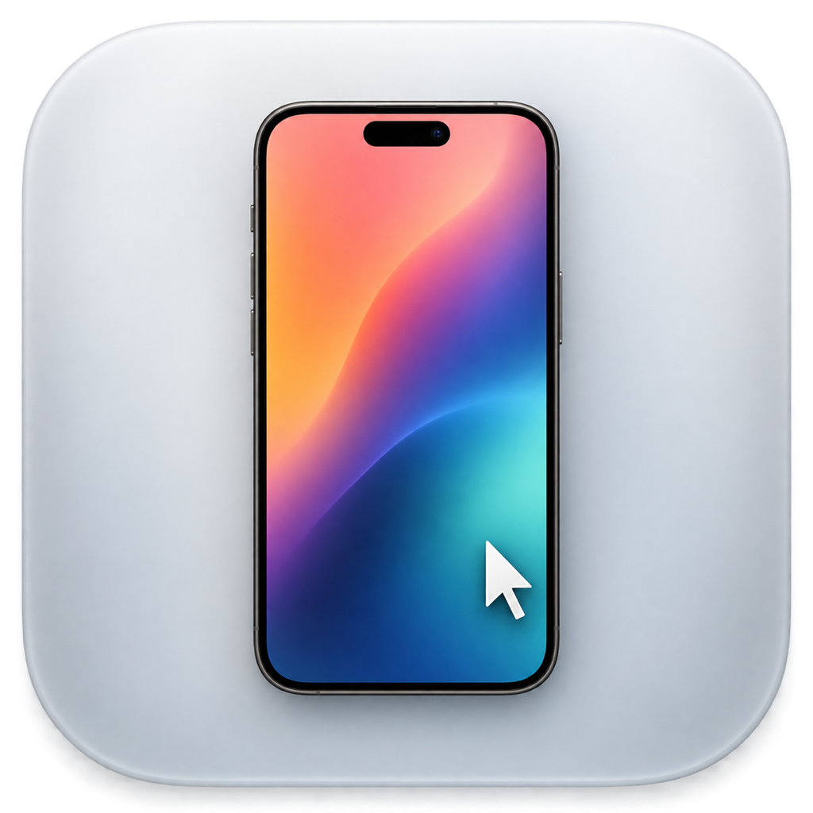

<div align="center">
  
  <h1>Phone Remote</h1>
  <p><strong>Your iPhone in a window on Apple Vision Pro or Mac, and usable from there.</strong></p>
  <p>iOS · visionOS · macOS · Apache-2.0</p>
</div>

> [!CAUTION]
> A personal, experimental project, provided **as is**, without any warranty. The author is not responsible for bugs, data loss, device problems or any other damage resulting from its use. Use it only on devices and networks you own. Nobody is asked or expected to use it: read the code, or build your own if you prefer.

## What it does

- Shows the iPhone's live screen in a phone-shaped window that turns when you rotate the phone.
- **Apple Vision Pro:** look and pinch to tap, pinch and drag to swipe, Home button under the phone, a hideable bar for keyboard, volume and lock.
- **Mac:** click to tap, drag or scroll to swipe, hold to long-press, type and paste from the Mac keyboard, ⌘1 Home, ⌘2 App Switcher, ⌘3 Spotlight, ⌘+ / ⌘− window size.
- One iPhone app for both: it mirrors to whichever Vision Pro or Mac has Phone Remote open.
- The iPhone stays awake while it's controlled, and the Mac's display stays on while mirroring.

```text
iPhone ── screen (H.264, encrypted, local Wi-Fi) ──▶ Vision Pro or Mac
       ◀── taps, swipes, typing ────────────────────
```

## How it works

- The iPhone streams its screen with **ReplayKit** (you confirm "Start Broadcast" each time; iOS always asks).
- Devices find each other with **Bonjour** on your Wi-Fi and connect directly: no server, no account, no internet.
- The connection is **TLS with a key derived from an 8-character pairing code** shown on the Vision Pro or Mac.
- **Control is optional.** iOS doesn't let an app tap other apps, so control uses **DeviceKit**, an XCTest runner that a Mac starts on the iPhone. It listens only on the iPhone itself (`127.0.0.1:12004`). The iPhone app can turn it off.

This is also why it isn't on the App Store or TestFlight: controlling the iPhone relies on Apple's developer testing tools, which Apple doesn't allow in distributed apps.

## Install

### Option A: with a Mac and Xcode (recommended, includes control)

Requirements: a Mac with Xcode, an Apple ID signed into Xcode (a free Personal Team works; its builds expire after 7 days), Developer Mode on the iPhone and Vision Pro, all devices on the same Wi-Fi.

```bash
./scripts/install.sh YOUR_TEAM_ID
```

This builds and installs the apps on your iPhone and Vision Pro, puts the Mac app in `~/Applications`, and starts control. Your Team ID is in Xcode › Settings › Accounts.

### Option B: sideload the release files (mirroring; control still needs Xcode)

From the Releases page:

| File | Where | How |
|---|---|---|
| `PhoneRemote-iOS.ipa` | iPhone | AltStore, SideStore, Sideloadly… (they re-sign it with your Apple ID) |
| `PhoneRemote-visionOS.ipa` | Apple Vision Pro | a sideloading tool that supports visionOS, or Xcode |
| `PhoneRemote-macOS.dmg` | Mac | drag to Applications |

The files are **not signed with any developer certificate**. On the Mac, the first time: right-click the app › Open, or run `xattr -dr com.apple.quarantine "/Applications/Phone Remote.app"`. Check downloads against `SHA256SUMS`.

To add control with Option B, the Mac app asks for your Team ID and starts DeviceKit itself (Xcode must be installed). See [docs/CONTROL.md](docs/CONTROL.md).

## Use

1. Open Phone Remote on the Vision Pro or Mac. It shows a pairing code.
2. Open Phone Remote on the iPhone, choose the device, enter the code (once).
3. Tap **Start Mirroring**, then **Start Broadcast**.

## Security and privacy

- Nothing leaves your local network, and nothing is collected.
- Pairing uses TLS 1.2 with a pre-shared key from the 8-character code. It's meant for a home network: someone who records the traffic could try to guess the code offline. Avoid public Wi-Fi.
- While DeviceKit runs, **any app on that iPhone can send it taps** (it has no password). Turn control off when you're not using it.
- iOS hides passwords and some protected video from screen broadcasts.

## Build from source

```bash
brew install xcodegen          # only to regenerate the Xcode project
./scripts/build-release.sh     # IPAs, DMG and SHA256SUMS in dist/
```

## Support

Free. If you'd like to support it, there's a donation link on this page. There's absolutely no obligation.

## License

Apache License 2.0, see [LICENSE](LICENSE) and [NOTICE](NOTICE). Third-party components: [THIRD-PARTY-NOTICES.md](THIRD-PARTY-NOTICES.md).

Not affiliated with or endorsed by Apple Inc. iPhone, Apple Vision Pro, Mac, iOS, visionOS, macOS, ReplayKit and Xcode are trademarks of Apple Inc.
